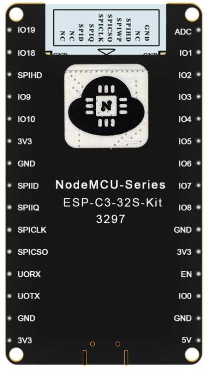

# Platformio Ai-thinker esp32-c3 blink template with builtin JTAG debugging capability.

1. To be able to view periph regs while debugging, you need to copy esp32c3.svd to PLATFORM_ROOT/misc/svd directory

2. Platformio's openocd-esp32 compiled without builtin JTAG support. Correct version of openocd-esp32 is bundled with this project, but you can obtain it here https://github.com/espressif/openocd-esp32/releases

3. If you are getting x509_crt_bundle error during compilation, edit ~/.platformio/packages/framework-espidf/components/mbedtls/esp_crt_bundle/cacrt_all.pem and remove the EC-ACC certificate or apply any other fix from
 https://github.com/espressif/esp-idf/issues/5322

4. To run ESP_IDF's menuconfig type this in platformio terminal: pio run -t menuconfig

5. If ESP_IDF's menuconfig is not working on linux: sudo apt install libncurses5-dev flex bison

6. Disable memory protection in menuconfig: toggle Component config → ESP System Settings → Memory protection → Enable memory protection (also you can compile latest openocd-esp32 that works with memory protection set)

7. Enable ocd stubs in menuconfig: toggle Component config → ESP32C3-Specific OpenOCD → debugStubs

8. If platformio debugger is not working on linux: apt-get install libpython2.7

9. IMPORTANT: Do not forget to use good quiality USB cable without hub or use external power supply, because it may trigger BROWNOUT(and some others) event on startup and you'll spend a lot of time finding the reason.

10. Pinout for builtin jtag/serial: io18 - d-, io19 - d+, link to board description: https://docs.ai-thinker.com/en/esp32c3

11. On linux you need to install udev rules from openocd-esp32 folder: sudo cp openocd/share/openocd/contrib/60-openocd.rules /etc/udev/rules.d/60-openocd.rules
